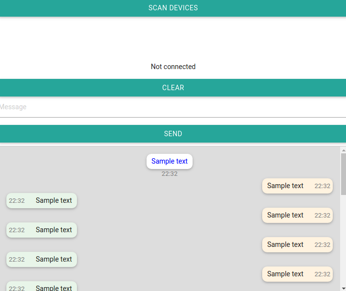

## Description

Simple Bluetooth LE chat client on Cordova

## Install Cordova

Full guide [here](https://cordova.apache.org/docs/en/5.1.1/guide_cli_index.md.html#The%20Command-Line%20Interface)

    $ sudo npm install -g cordova

## BLE plugin for Cordova

Bluetooth Low Energy (BLE) Central Plugin for Apache Cordova

Available at https://github.com/don/cordova-plugin-ble-central

    cordova plugin add com.megster.cordova.ble

## Developer resources

* [Apache Cordova API](https://cordova.apache.org/docs/en/5.1.1/cordova_plugins_pluginapis.md.html#Plugin%20APIs)
* [Materialize CSS](http://materializecss.com/)
* [BLE plugin Github](https://github.com/don/cordova-plugin-ble-central)
* [BLE examples](https://github.com/don/cordova-plugin-ble-central/tree/master/examples)
